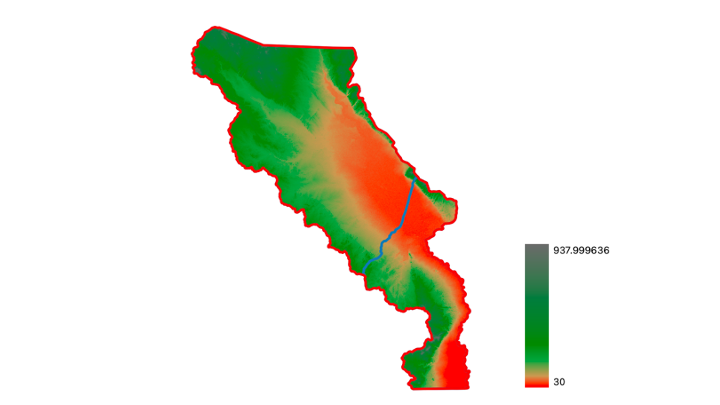
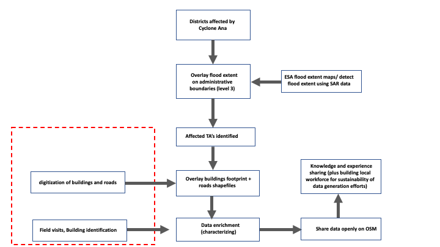

# Collaborative High Impact Mapping Project

*Credits: UNICEF Malawi/2022/HD Plus*
# Background
The Consortium of MRCs, OpenstreetMap Malawi, and Nkhoma University with funding by the Humanitarian OpenstreetMap Team (HOT) through the Eastern and Southern African Hub (ESA) to map the regions heavily impacted by Cyclone Ana, specifically Chikwawa and Nsanje. The project aims to produce geospatial data that will aid in disaster recovery and planning efforts. While, they are implementing the project another devastating cyclone Freddy has hit the same region. Malawi Red Cross with its consortium members organised sevral  events yet following its planned activities.

  <h1>consortium</h1>
  
Malawi Redcross Society.

  
   <h1> </h1>
  
[MORE](https://twitter.com/MalawiRedCross)

  
openstreet map malawi.

  

 

[MORE](https://twitter.com/OSMMalawi)

Nkhoma University

[MORE](https://https://www.nkhoma.ac.mw/index.php)
  
  

# PROJECT ACTIVITIES

### *MAPATHONS (NKHUNI) (LUANAR) (CHANCO)

### *CAPACITY BUIDING 
The study targets Nsanje and Chikwawa districts in Southern Malawi. The study area has an elevation between 30 and 938 meters above sea level.  

- Talk about low elevation, talk about local rivers in the districts including passerby (Shire River)

#Create a map of the study districts based on classified topographical map of southern Malawi
- Add all rivers

# Mapping of flood extent
Description

Figure 1. Workflow for generation of flood extent maps
SARS Data
Using Digital Earth Africa Sandbox

# Mapping of infrastructure and affected communities
Buildings from OSM

#Validation of the flood extent maps
Participatory mapping

# Results

Table showing OSM roads and buildings that are within the flood extent
